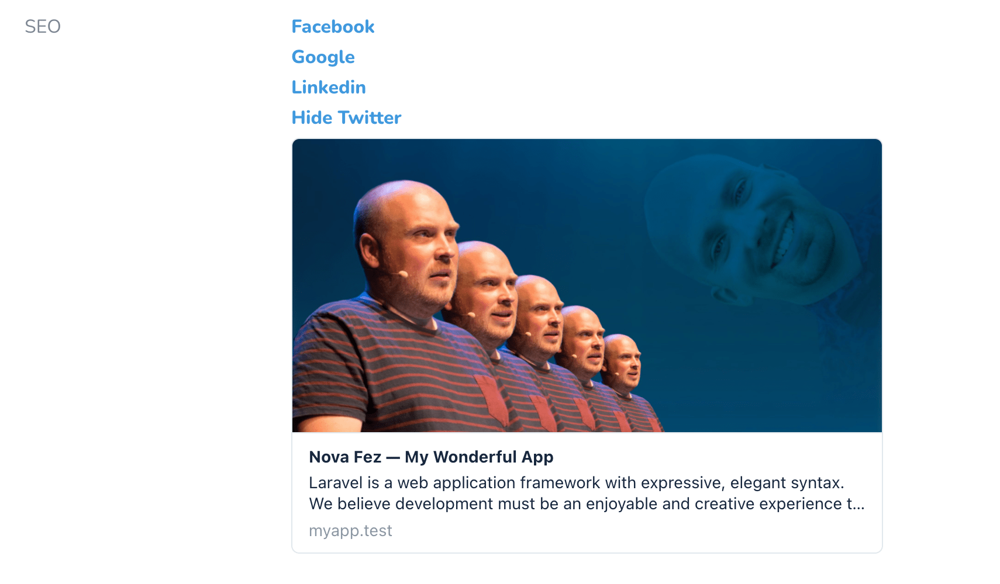

# A supplemental Nova field for use with Fez

[](https://packagist.org/packages/dive-be/nova-fez)

This package allows you to **preview** social media posts / search engine results right in your `Metable` resources.

> It is, and will stay an approximation.

## Requirements

- `dive-be/laravel-fez: ^0.4`
- `laravel/nova: ^3.0`

## Installation

You can install the package via composer:

```bash
composer require dive-be/nova-fez
```
## Usage

```php
use Dive\Fez\Nova\Fez;

public function fields(Request $request)
{
    return [
        Fez::make('SEO'),
    ];   
}
```

## Screenshots



## Changelog

Please see [CHANGELOG](CHANGELOG.md) for more information on what has changed recently.

## Contributing

Please see [CONTRIBUTING](CONTRIBUTING.md) for details.

## Security

If you discover any security related issues, please email oss@dive.be instead of using the issue tracker.

## Credits

- [Muhammed Sari](https://github.com/mabdullahsari)
- [All Contributors](../../contributors)

## License

The MIT License (MIT). Please see [License File](LICENSE.md) for more information.
